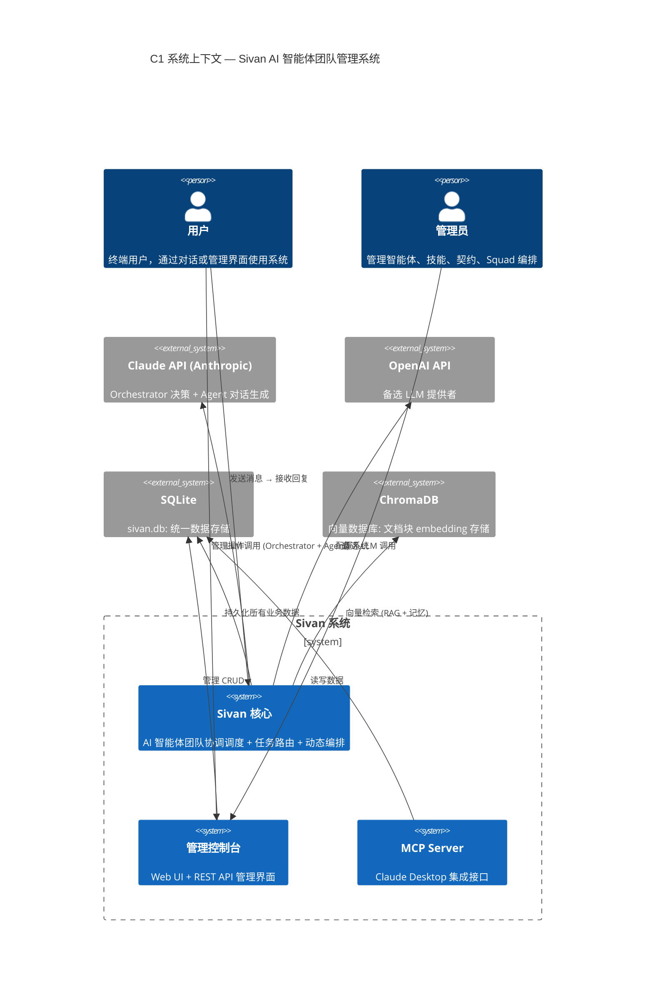
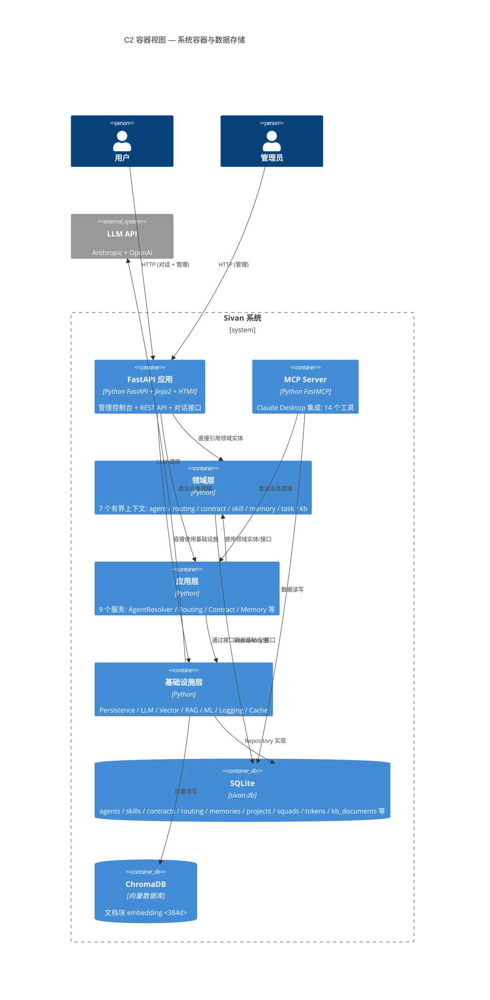
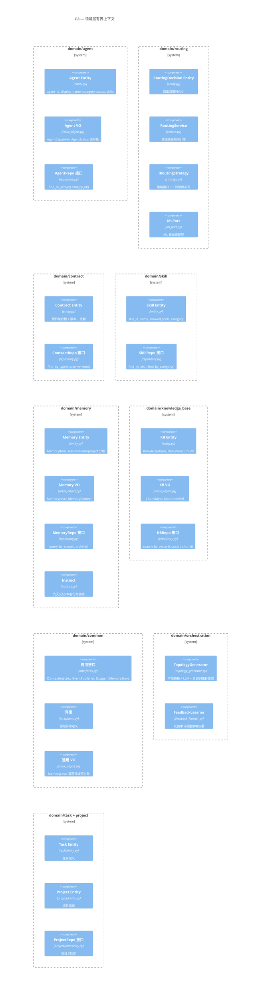
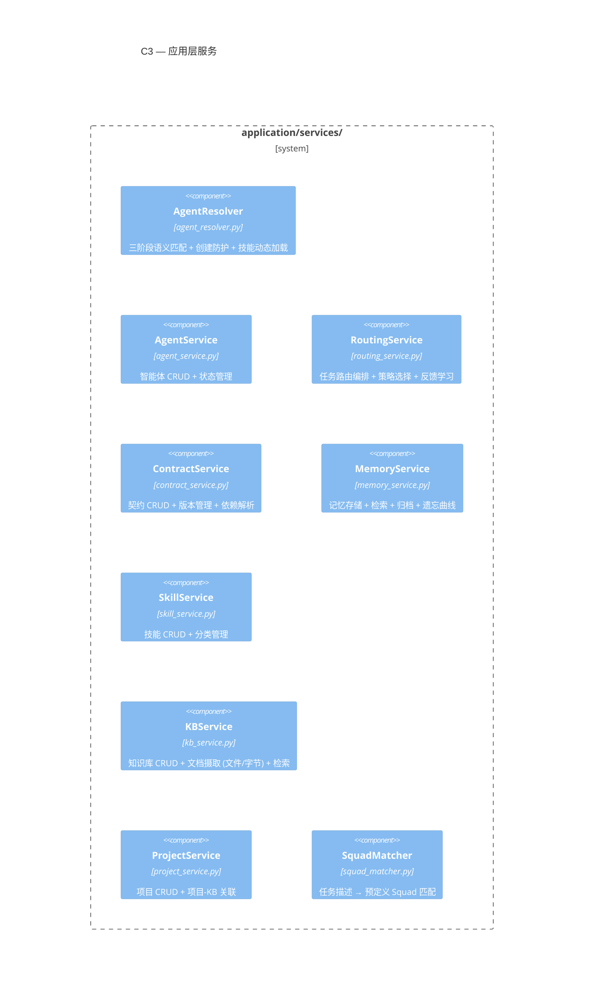
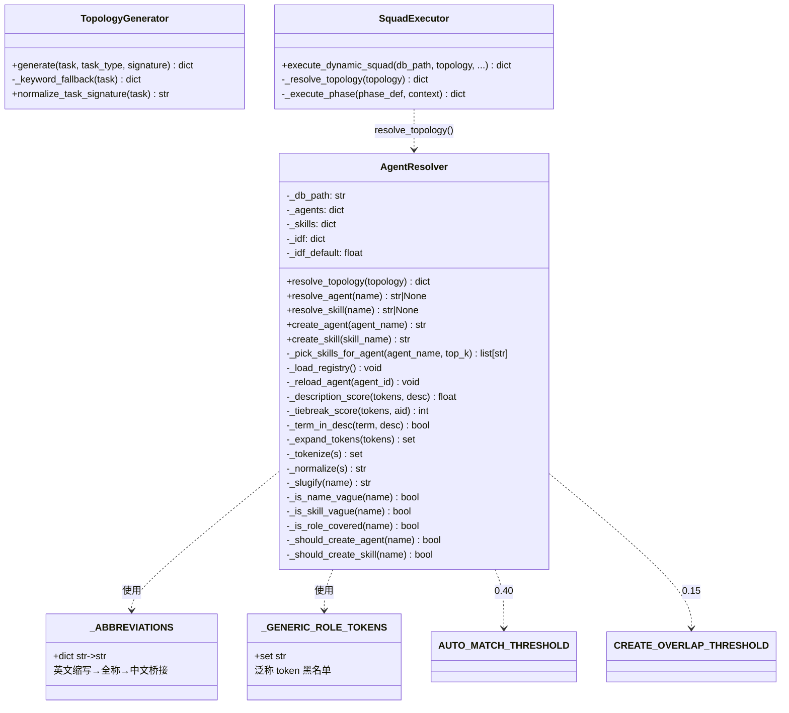
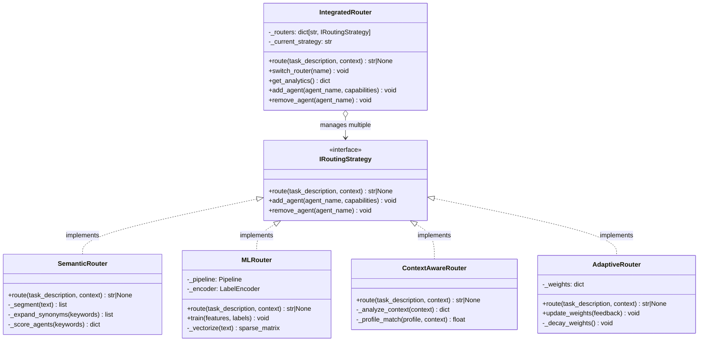
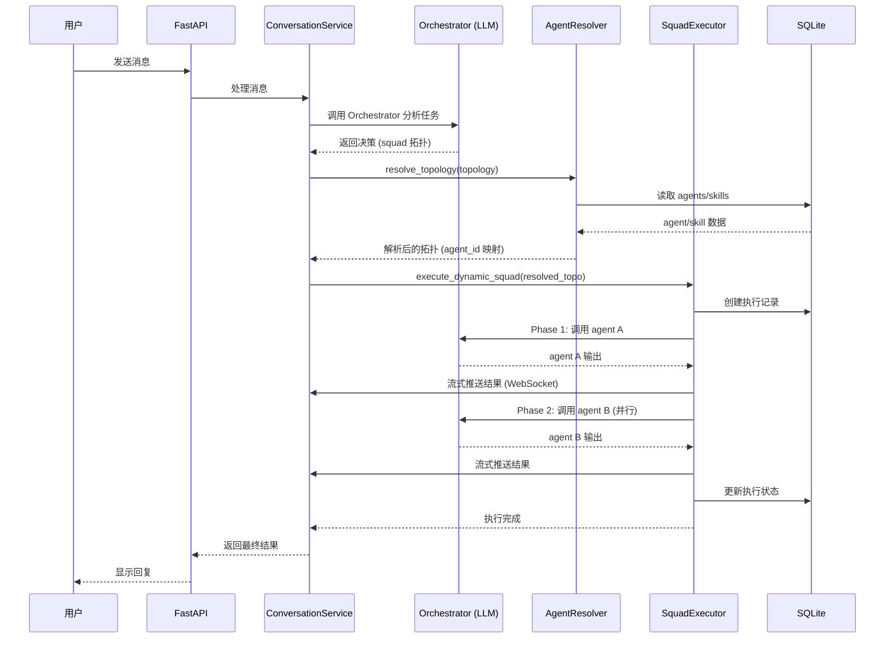
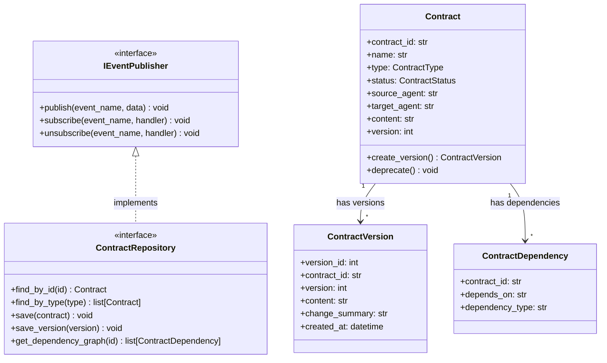
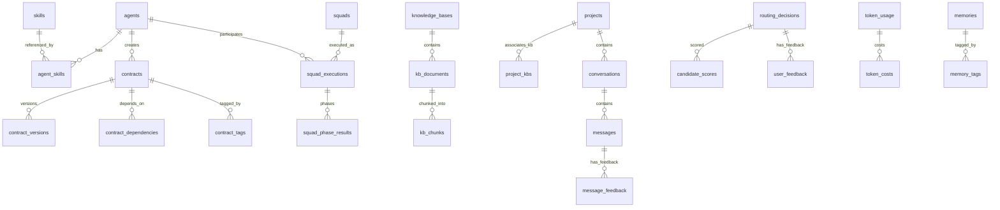

# Sivan 系统架构 — C4 模型

> 本文档使用 C4 模型（Context → Container → Component → Code）描述 Sivan AI 智能体团队管理系统的完整架构。
> 覆盖 DDD 四层（domain / application / infrastructure / interfaces）及各层内所有模块的职责、边界与交互。

---

## C1 — 系统上下文 (System Context)



**外部系统说明：**

| 系统 | 角色 | 交互方式 |
|------|------|----------|
| 用户 | 终端使用者 | 通过对话发送任务、查看回复 |
| 管理员 | 系统运维 | 通过 Web 管理控制台配置系统 |
| Claude API | 主要 LLM 提供者 | Orchestrator 决策 + Agent 对话生成 |
| OpenAI API | 备选 LLM 提供者 | 部分 Agent 使用 |
| SQLite | 主数据库 | 所有业务数据的持久化存储 |
| ChromaDB | 向量数据库 | 文档块 embedding 存储与语义检索 |

---

## C2 — 容器 (Container)



**容器职责：**

| 容器 | 入口 | 职责 |
|------|------|------|
| FastAPI 应用 | `admin_console.py` | Web 管理控制台 + 对话 API + 14 个路由模块 |
| MCP Server | `server.py` | Claude Desktop 集成，14 个 MCP 工具 |
| 领域层 | `domain/` | 业务核心，7 个有界上下文，与技术无关 |
| 应用层 | `application/` | 编排领域对象完成用例，9 个服务 |
| 基础设施层 | `infrastructure/` | 技术能力实现：DB / LLM / Vector / RAG 等 |
| SQLite | `data/sivan.db` | 统一数据库，10+ 业务表 |
| ChromaDB | `data/chroma/` | 向量持久化，384 维 embedding |

---

## C3 — 组件 (Component)

### 3.1 领域层 (Domain Layer)

领域层包含 7 个有界上下文，遵循 DDD 战术模式：**Entity**、**Value Object**、**Repository 接口**、**Domain Service**。



**分层依赖规则：**
- 领域层 **不依赖** application / infrastructure / interfaces 任何代码
- 领域层通过 `Repository 接口` 实现依赖倒置（具体实现在基础设施层）
- 领域服务操作实体和值对象，不直接访问数据库

---

### 3.2 应用层 (Application Layer)

应用层编排领域对象完成用例，不包含业务规则。



**各服务详细职责：**

| 服务 | 核心能力 |
|------|----------|
| **AgentResolver** | `resolve_topology()` — 解析 LLM 输出的角色名到数据库 agent_id；三阶段匹配（精确 → 归一化 → 描述语义 IDF 加权）；创建防护（特异性检查 + SRP 重叠）；技能动态加载（继承最相似 agent + top-k 防超级单体） |
| **RoutingService** | `route()` — 集成 5 种路由策略；`add_agent()` / `remove_agent()` — 管理路由表；`get_analytics()` — 路由统计分析；`provide_feedback()` — 反馈学习 |
| **ContractService** | `create_contract()` — 创建契约（含版本号）；`list_contracts()` — 多条件筛选；`update_status()` — 状态流转（draft → reviewed → approved → deprecated）；`get_dependency_graph()` — 依赖关系图谱 |
| **MemoryService** | `store()` — 按级别存储记忆；`retrieve()` — 多级检索；`archive()` — 低保留率归档；`forgetting_curve_cleanup()` — 遗忘曲线衰减 |
| **KBService** | `ingest_file()` / `ingest_bytes()` — 多格式文档摄取（txt/md/pdf/csv）；`search()` — 向量 + FTS 混合检索；`list_documents()` / `delete_document()` |
| **SquadMatcher** | `match()` — 计算任务描述与预定义 Squad 的相似度；`top_k()` — 返回 Top-N 匹配 |

---

### 3.3 基础设施层 (Infrastructure Layer)

基础设施层提供技术能力的实现，包括持久化、LLM 调用、向量检索等。

```mermaid
C4Component
  title C3 — 基础设施层模块

  Boundary(b0, "infrastructure/persistence/") {
    Component(conn, "SQLiteConnectionManager", "connection.py", "数据库连接池管理 (单例)")
    Component(db, "Database", "database.py", "建表 + 迁移")
    Component(models, "Data Models", "models.py", "SQLAlchemy Core 表定义")
    Component(agent_repo, "AgentRepoImpl", "agent_repo.py", "AgentRepository 实现")
    Component(routing_repo, "RoutingRepoImpl", "routing_repo.py", "RoutingRepository 实现")
    Component(contract_repo, "ContractRepoImpl", "contract_repo.py", "ContractRepository 实现")
    Component(skill_repo, "SkillRepoImpl", "skill_repo.py", "SkillRepository 实现")
    Component(memory_repo, "MemoryRepoImpl", "memory_repo.py", "MemoryRepository 实现")
    Component(kb_repo, "KBRepoImpl", "kb_repo.py", "KBRepository 实现")
    Component(project_repo, "ProjectRepoImpl", "project_repo.py", "ProjectRepository 实现")
    Component(token_repo, "TokenRepoImpl", "token_repo.py", "Token 使用记录存储")
  }

  Boundary(b1, "infrastructure/llm/") {
    Component(llm_base, "LLMBase", "base.py", "抽象 LLM 提供者接口")
    Component(anthropic, "AnthropicProvider", "anthropic_provider.py", "Claude API 调用 (含流式)")
    Component(openai, "OpenAIProvider", "openai_provider.py", "OpenAI API 调用")
    Component(factory, "LLMFactory", "factory.py", "根据 model name 创建 Provider")
  }

  Boundary(b2, "infrastructure/agents/") {
    Component(agent_base, "BaseAgent", "base.py", "模板方法: _execute_core() 由子类实现")
    Component(generic, "GenericAgent", "generic_agent.py", "通用智能体: 技能驱动 + 路由决策")
    Component(orchestrator, "OrchestratorAgent", "orchestrator.py", "ReAct 三阶段: 分析 → 决策 → 执行/回退")
    Component(instances, "Agent 实例", "instances/", "预留具体 Agent 实例化模块")
  }

  Boundary(b3, "infrastructure/rag/ + vector/") {
    Component(doc_proc, "DocumentProcessor", "rag/document_processor.py", "txt/md/pdf/csv 解析 + 分块")
    Component(embedding, "EmbeddingService", "rag/embedding.py", "sentence-transformers 384d 编码")
    Component(chroma, "ChromaStore", "vector/chroma_store.py", "通用向量存储 CRUD")
    Component(kb_chroma, "KBChromaStore", "vector/kb_chroma_store.py", "知识库专用向量存储 (过滤/分页)")
  }

  Boundary(b4, "infrastructure/memory/") {
    Component(forgetting, "ForgettingCurve", "forgetting_curve.py", "Ebbinghaus 遗忘曲线计算")
    Component(session_mem, "SessionMemory", "session_memory.py", "线程安全会话记忆环缓冲区")
    Component(context_inj, "ContextInjector", "context_injector.py", "记忆上下文注入到 system_prompt")
    Component(flashback, "FlashbackScanner", "flashback_scanner.py", "周期性闪回扫描")
    Component(instinct_repo, "InstinctRepo", "instinct_repo.py", "先天记忆持久化")
  }

  Boundary(b5, "infrastructure/logging/ + ml/ + cache/") {
    Component(log_setup, "Logger Setup", "logging/setup.py", "日志配置 + 文件轮转")
    Component(db_logger, "DBLogger", "logging/db_logger.py", "结构化日志写入数据库")
    Component(classifier, "ML Classifier", "ml/classifier.py", "scikit-learn TF-IDF + 集成分类器")
    Component(cache, "Cache", "cache/__init__.py", "缓存抽象层")
  }
```



**基础设施层设计要点：**

- **Repository 模式**：领域层定义接口，基础设施层实现（依赖倒置）
- **LLM 工厂模式**：根据 `model_name` 创建对应 Provider（Anthropic / OpenAI）
- **Agent 模板方法**：`BaseAgent._execute_core()` 定义执行骨架，`OrchestratorAgent` 和 `GenericAgent` 各有实现
- **ChromaDB 双 store**：通用 ChromaStore + KBChromaStore（带 kb_name 过滤）
- **ML 持久化**：scikit-learn pipeline 序列化为 `.pkl` 文件，支持增量训练

---

### 3.4 接口层 (Interface Layer)

接口层对外暴露系统能力，包括 REST API 和 MCP 协议两种形式。

```mermaid
C4Component
  title C3 — 接口层

  Boundary(b0, "interfaces/api/") {
    Component(admin, "FastAPI App", "admin.py", "FastAPI 入口 + 中间件 + 静态文件")
    Component(ctx, "AppContext", "context.py", "共享上下文: 数据库连接 + 服务实例 + Jinja2")

    Boundary(b1, "routes/ (14 个)") {
      Component(r_dash, "Dashboard", "dashboard.py", "系统概览统计")
      Component(r_agents, "Agents", "agents.py", "智能体管理 CRUD")
      Component(r_conv, "Conversations", "conversations.py", "对话 CRUD + 流式 + HITL")
      Component(r_kb, "KB", "knowledge_base.py", "知识库 + 文档管理")
      Component(r_routing, "Routing", "routing.py", "路由分析 + 趋势")
      Component(r_tokens, "Tokens", "tokens.py", "Token 统计 + 成本趋势")
      Component(r_contracts, "Contracts", "contracts.py", "契约管理")
      Component(r_skills, "Skills", "skills.py", "技能 CRUD")
      Component(r_squads, "Squads", "squads.py", "Squad 编排 + 执行")
      Component(r_projects, "Projects", "projects.py", "项目 CRUD + KB 关联")
      Component(r_memory, "Memory", "memory.py", "记忆管理")
      Component(r_logs, "Logs", "logs.py", "日志查看")
      Component(r_reports, "Reports", "reports.py", "周报生成/管理")
      Component(r_settings, "Settings", "settings.py", "系统设置")
    }

    Boundary(b2, "services/ (17 个)") {
      Component(s_base, "BaseService", "base.py", "数据表访问基类 (DB 操作)")
      Component(s_agents, "AgentService", "agents.py", "智能体管理")
      Component(s_conv, "ConversationService", "conversations.py", "对话 + 消息 + 流式 + Squad")
      Component(s_kb, "KBService", "knowledge_base.py", "知识库 + 文档管理")
      Component(s_routing, "RoutingService", "routing.py", "路由分析服务")
      Component(s_tokens, "TokenService", "tokens.py", "Token 统计服务")
      Component(s_contracts, "ContractService", "contracts.py", "契约管理服务")
      Component(s_skills, "SkillService", "skills.py", "技能管理服务")
      Component(s_squads, "SquadService", "squads.py", "Squad + 执行引擎")
      Component(s_projects, "ProjectService", "projects.py", "项目管理")
      Component(s_memory, "MemoryService", "memory.py", "记忆管理")
      Component(s_logs, "LogService", "logs.py", "日志查询")
      Component(s_reports, "ReportService", "reports.py", "周报生成")
      Component(s_settings, "SettingService", "settings.py", "配置管理")
      Component(s_feedback, "TopologyFeedback", "topology_feedback.py", "拓扑反馈")
      Component(s_instinct, "InstinctService", "instinct_patterns.py", "先天模式")
      Component(s_sys, "SystemService", "system.py", "系统状态")
      Component(s_ws, "WSManager", "ws_manager.py", "WebSocket 连接管理")
    }
  }

  Boundary(b3, "interfaces/mcp/") {
    Component(mcp, "MCP Server", "server.py", "FastMCP: 14 个工具 (智能体/路由/契约/知识库)")
  }

  Boundary(b4, "templates/ (15 个)") {
    Component(t_base, "base.html", "基地模板", "侧边栏导航 + 暗夜模式")
    Component(t_chat, "chat.html", "对话界面", "Alpine.js 流式渲染")
    Component(t_agents, "agents.html", "智能体管理")
    Component(t_skills, "skills.html", "技能管理")
    Component(t_contracts, "contracts.html", "契约管理")
    Component(t_dashboard, "dashboard.html", "仪表板")
    Component(t_squads, "squads.html", "Squad 编排")
    Component(t_others, "剩余 7 个", "", "路由/Token/日志/知识库/记忆/周报/设置")
  }

  Rel(admin, ctx, "初始化")
  Rel(admin, b1, "注册路由")
  Rel(b1, b2, "委派业务")
  Rel(b2, b0, "直接使用应用层 + 基础设施层")
  Rel(mcp, b0, "直接使用应用层 + 基础设施层")
```

**接口层设计要点：**

- **REST API 与 Web 页面共享路由**：Jinja2 模板渲染 + HTMX 交互，管理控制台和对话页面都在同一 FastAPI 应用中
- **14 个路由模块**和 **17 个服务模块**：路由负责 HTTP 协议适配，服务负责业务编排
- **Jinja2 模板 + Alpine.js**：对话页面使用 Alpine.js 实现流式消息渲染（Server-Sent Events）
- **MCP 服务器**：14 个工具暴露给 Claude Desktop，通过 FastMCP 框架与主系统共享数据库
- **WebSocket 管理器**：`ws_manager.py` 管理对话的 WebSocket 连接

---

## C4 — 关键代码设计 (Code)

### 4.1 AgentResolver：三阶段匹配 + 创建防护



**AgentResolver 匹配流程：**

```
resolve_agent("backend-engineer")
  │
  ├─ ① 精确匹配 agent_id → 是否等于 "be-dev"? 否
  ├─ ② 归一化匹配 → 去连字符转小写后相等? 否
  │     └─ 模糊名称检测: 有 "backend" 领域词 → 继续
  └─ ③ 描述语义匹配 (IDF 加权)
        ├─ BFS 展开 tokens: {"backend","engineer","后端","工程师","developer"}
        ├─ 遍历所有 agent description 计算 score
        │   └─ be-dev: "你是后端工程师..." → 匹配
        │       score = Σ(IDF matched) / Σ(IDF total)
        │       "后端"(IDF=2.890) + "工程师"(IDF=0.944) / total=3.834 = 1.000
        └─ score ≥ 0.40 → 返回 "be-dev"
```

**创建防护双检：**

```
_should_create_agent("blockchain-expert"):
  ① 特异性检查: tokens {"blockchain","expert"} - 泛称 → {"blockchain"} → 通过
  ② SRP 重叠检查: "blockchain" 不在任何 agent desc 中 → score=0 < 0.15 → 通过
  → 允许创建

_should_create_agent("engineer"):
  ① 特异性检查: tokens {"engineer"} - 泛称 → {} → 拒绝
```

---

### 4.2 路由系统：策略模式



**五种策略对比：**

| 策略 | 核心算法 | 适用场景 | 学习方式 |
|------|----------|----------|----------|
| SemanticRouter | jieba 分词 + 同义词扩展 + 特征权重 | 关键词明确的任务 | 特征权重在线更新 |
| MLRouter | TF-IDF + NaiveBayes/LogisticRegression/RandomForest 集成 | 大量历史决策 | 增量重训练 (数据 +50% 或超 7 天) |
| ContextAwareRouter | 8 维度上下文分析 + 智能体画像 | 复杂多维度任务 | 画像实时更新 |
| AdaptiveRouter | 动态权重 = f(成功率, 置信度, 执行时间, 反馈正确率) | 长期运行优化 | 每次反馈后衰减 + 调整 |
| IntegratedRouter | 统一管理 + 策略切换 + 综合分析 | 路由入口 | 汇总所有策略结果 |

---

### 4.3 Squad 执行：时序流程



**Squad 执行阶段：**

| 阶段 | 模式 | 说明 |
|------|------|------|
| Phase 1+ | sequential | 串行执行，前一个 agent 输出作为下一个的上下文 |
| Phase N+ | parallel | 并行执行多个 agent，结果合并 |
| HITL 暂停 | — | 等待人工确认后继续 / 修正 / 中止 |
| 终止 | — | 用户手动终止或 3 分钟超时保护 |

---

### 4.4 契约系统：观察者模式



---

## 数据库架构

sivan.db（SQLite）是整个系统的统一数据存储，包含以下核心表：



**核心表清单：**

| 表 | 用途 | 关联 |
|----|------|------|
| `agents` | 智能体定义（system_prompt, skills, tools） | → agent_skills |
| `skills` | 技能定义（allowed_tools, category） | ← agent_skills |
| `contracts` | 契约聚合根（status, version） | → contract_versions, contract_dependencies |
| `conversations` | 对话头（project_id） | → messages |
| `messages` | 消息记录（role, content, metadata, status） | ← conversations |
| `squads` | 预定义 Squad + 自动创建 | → squad_executions |
| `routing_decisions` | 路由决策记录 | → candidate_scores, user_feedback |
| `knowledge_bases` | 知识库 + 关联项目 | → kb_documents, project_kbs |
| `memories` | 分级记忆（session/user/team/project） | → memory_tags |
| `projects` | 项目隔离 | → project_kbs, conversations |
| `token_usage` | Token 消耗记录 | → token_costs |
| `settings` | 系统配置键值对 | — |

---

## 依赖与数据流

### 分层依赖规则

```
interfaces/api/  ──→  application/services/  ──→  domain/  (实体/接口)
                                      │
                                      └────────→  infrastructure/  (实现)
                                                      │
                                                      └→ domain/  (实现 Repository 接口)
```

- **Domain 层**：零外部依赖，纯 Python 业务逻辑
- **Application 层**：依赖 domain（实体 + 接口）+ 通过接口调用 infrastructure
- **Infrastructure 层**：实现 domain Repository 接口 + 直接依赖外部库（SQLAlchemy, chromadb, anthropic 等）
- **Interfaces 层**：依赖 application + infrastructure，负责协议适配（HTTP / MCP / WebSocket）

### 核心数据流：对话 → Squad 执行

```
用户输入
  │
  ▼
FastAPI (routes/conversations.py)
  │
  ▼
ConversationService.send_message()
  │
  ├─ Orchestrator 分析 (LLM 调用)
  │     └─ decision: "squad" | "direct" | "clarify"
  │
  ├─ [squad] SquadMatcher.match() → 预定义 Squad
  │         └─ AgentResolver.resolve_topology()
  │              └─ SquadExecutor.execute_dynamic_squad()
  │                   ├─ Phase 1: agent A (sequential)
  │                   ├─ Phase 2: agent B + C (parallel)
  │                   ├─ [HITL] pause → wait → continue/abort
  │                   └─ Phase 3: agent D (sequential)
  │
  ├─ [direct] → GenericAgent._execute_core() → 生成回复
  │
  └─ WebSocket 流式推送结果
```

---

## 模块边界 (文件清单)

| 层 | 文件 | 职责 |
|----|------|------|
| **Domain** | `domain/agent/entity.py` | Agent 实体：agent_id, display_name, category, status, system_prompt |
| | `domain/agent/value_object.py` | AgentCapability, AgentStatus 值对象 |
| | `domain/agent/repository.py` | AgentRepository 接口 |
| | `domain/routing/entity.py` | RoutingDecision 实体 + CandidateScore |
| | `domain/routing/strategy.py` | IRoutingStrategy 接口 + 5 种策略实现 |
| | `domain/routing/service.py` | Domain RoutingService (策略选择规则) |
| | `domain/routing/ml_port.py` | ML 路由适配端口 |
| | `domain/contract/entity.py` | Contract 聚合根 + ContractVersion + ContractDependency |
| | `domain/contract/repository.py` | ContractRepository 接口 |
| | `domain/skill/entity.py` | Skill 实体 |
| | `domain/skill/repository.py` | SkillRepository 接口 |
| | `domain/memory/entity.py` | MemoryItem 实体 (多级) |
| | `domain/memory/value_object.py` | MemoryLevel, MemoryContext 值对象 |
| | `domain/memory/repository.py` | MemoryRepository 接口 |
| | `domain/memory/instinct.py` | 先天记忆/本能定义 |
| | `domain/knowledge_base/entity.py` | KnowledgeBase, Document, Chunk 实体 |
| | `domain/knowledge_base/value_object.py` | ChunkMeta 值对象 |
| | `domain/knowledge_base/repository.py` | KBRepository 接口 |
| | `domain/task/entity.py` | Task 实体 |
| | `domain/project/entity.py` | Project 实体 |
| | `domain/project/repository.py` | ProjectRepository 接口 |
| | `domain/orchestration/topology_generator.py` | TopologyGenerator (3 种策略) |
| | `domain/orchestration/feedback_learner.py` | FeedbackLearner |
| | `domain/common/interfaces.py` | IContextInjector, IEventPublisher, ILogger, IMemoryStore |
| | `domain/common/exceptions.py` | 领域异常定义 |
| | `domain/common/value_object.py` | 跨领域值对象 |
| **Application** | `application/services/agent_resolver.py` | AgentResolver: 三阶段匹配 + 创建防护 + 技能加载 |
| | `application/services/agent_service.py` | AgentService: 智能体 CRUD + 状态管理 |
| | `application/services/routing_service.py` | RoutingService: 任务路由编排 + 反馈学习 |
| | `application/services/contract_service.py` | ContractService: 契约 CRUD + 版本 + 依赖 |
| | `application/services/memory_service.py` | MemoryService: 记忆存储 + 检索 + 归档 |
| | `application/services/skill_service.py` | SkillService: 技能 CRUD |
| | `application/services/kb_service.py` | KBService: 知识库 + 文档摄取 + 检索 |
| | `application/services/project_service.py` | ProjectService: 项目 CRUD + KB 关联 |
| | `application/services/squad_matcher.py` | SquadMatcher: 任务-预定义 Squad 匹配 |
| **Infrastructure** | `infrastructure/persistence/connection.py` | SQLiteConnectionManager |
| | `infrastructure/persistence/models.py` | SQLAlchemy Core 表定义 (10+ 表) |
| | `infrastructure/persistence/database.py` | 建表 + 迁移 |
| | `infrastructure/persistence/agent_repo.py` | AgentRepository 实现 |
| | `infrastructure/persistence/routing_repo.py` | RoutingRepository 实现 |
| | `infrastructure/persistence/contract_repo.py` | ContractRepository 实现 |
| | `infrastructure/persistence/skill_repo.py` | SkillRepository 实现 |
| | `infrastructure/persistence/memory_repo.py` | MemoryRepository 实现 |
| | `infrastructure/persistence/kb_repo.py` | KBRepository 实现 |
| | `infrastructure/persistence/project_repo.py` | ProjectRepository 实现 |
| | `infrastructure/persistence/token_repo.py` | Token 记录存储 |
| | `infrastructure/agents/base.py` | BaseAgent 模板方法 |
| | `infrastructure/agents/generic_agent.py` | GenericAgent (技能驱动) |
| | `infrastructure/agents/orchestrator.py` | OrchestratorAgent (ReAct 三阶段) |
| | `infrastructure/llm/base.py` | LLM 提供者抽象接口 |
| | `infrastructure/llm/anthropic_provider.py` | Claude API Provider |
| | `infrastructure/llm/openai_provider.py` | OpenAI API Provider |
| | `infrastructure/llm/factory.py` | LLMFactory |
| | `infrastructure/rag/document_processor.py` | 文档解析器 (txt/md/pdf/csv) |
| | `infrastructure/rag/embedding.py` | 文本编码 (384d) |
| | `infrastructure/vector/chroma_store.py` | 通用 ChromaDB 存储 |
| | `infrastructure/vector/kb_chroma_store.py` | 知识库专用 ChromaDB 存储 |
| | `infrastructure/memory/forgetting_curve.py` | 遗忘曲线算法 |
| | `infrastructure/memory/session_memory.py` | 会话记忆环缓冲区 |
| | `infrastructure/memory/context_injector.py` | 记忆上下文注入 |
| | `infrastructure/memory/flashback_scanner.py` | 闪回扫描 |
| | `infrastructure/memory/instinct_repo.py` | 先天记忆持久化 |
| | `infrastructure/logging/setup.py` | 日志配置 + 轮转 |
| | `infrastructure/logging/db_logger.py` | 数据库日志记录 |
| | `infrastructure/ml/classifier.py` | scikit-learn 集成分类器 |
| **Interface** | `interfaces/api/admin.py` | FastAPI 入口 + 中间件 + 静态文件 |
| | `interfaces/api/context.py` | 共享上下文初始化 |
| | `interfaces/api/routes/dashboard.py` | 仪表板统计路由 |
| | `interfaces/api/routes/agents.py` | 智能体管理路由 |
| | `interfaces/api/routes/conversations.py` | 对话 + 消息 + 流式路由 |
| | `interfaces/api/routes/knowledge_base.py` | 知识库路由 |
| | `interfaces/api/routes/routing.py` | 路由分析路由 |
| | `interfaces/api/routes/tokens.py` | Token 统计路由 |
| | `interfaces/api/routes/contracts.py` | 契约路由 |
| | `interfaces/api/routes/skills.py` | 技能路由 |
| | `interfaces/api/routes/squads.py` | Squad 路由 |
| | `interfaces/api/routes/projects.py` | 项目路由 |
| | `interfaces/api/routes/memory.py` | 记忆路由 |
| | `interfaces/api/routes/logs.py` | 日志路由 |
| | `interfaces/api/routes/reports.py` | 周报路由 |
| | `interfaces/api/routes/settings.py` | 设置路由 |
| | `interfaces/api/services/base.py` | API 服务基类 |
| | `interfaces/api/services/conversations.py` | 对话 + Squad + 流式 |
| | `interfaces/api/services/squads.py` | Squad 执行引擎 |
| | `interfaces/api/services/ws_manager.py` | WebSocket 管理 |
| | `interfaces/api/services/agents.py` | 智能体管理 |
| | (其他 12 个服务文件匹配对应路由) |
| | `interfaces/mcp/server.py` | FastMCP 服务器 (14 个工具) |
| **Config** | `config/settings.py` | 统一配置 (DB, LLM, Memory, Auth, SMTP 等) |
| **Templates** | `templates/base.html` | 基础布局 + 暗夜模式 |
| | `templates/chat.html` | 对话界面 (Alpine.js) |
| | `templates/dashboard.html` | 仪表板 |
| | (12 个其他模板) | 对应各管理页面 |
